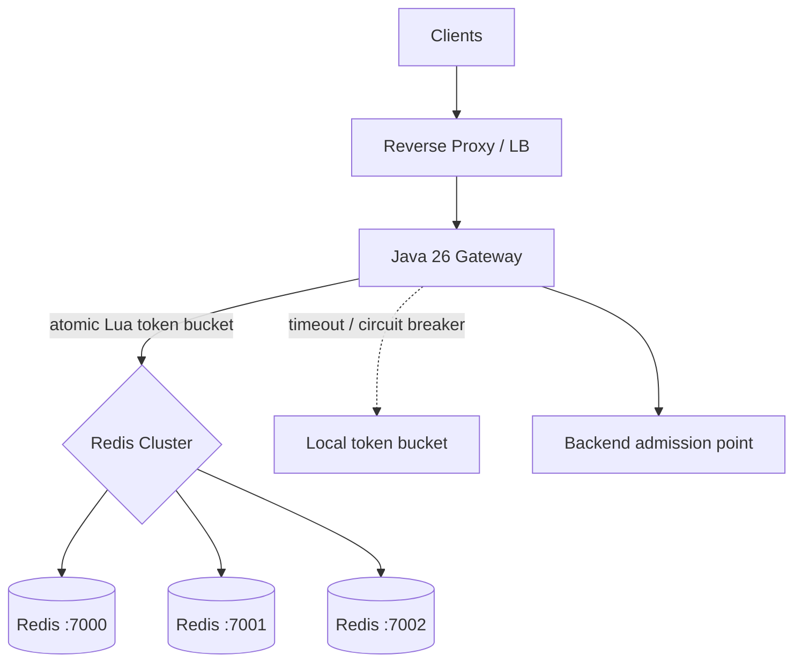

# Distributed Rate Limiter

A Java 26 implementation of a globally coordinated token-bucket rate limiter backed by Redis Cluster, with bounded local fallback when Redis is unavailable.

The first milestone is designed to run entirely on **one Linux machine** for debugging and testing while preserving the same logical boundaries needed for a horizontally scaled deployment.

## Architecture



See [`docs/architecture.md`](docs/architecture.md) for the algorithm, failure behavior, cluster routing, hot-key discussion, and current limitations.

## Prerequisites

- Linux
- **Java 26**
- Maven 3.9+
- Docker Engine with Docker Compose plugin
- `curl` for the smoke test

Check:

```bash
java -version
mvn -version
docker compose version
```

## Build and test

```bash
mvn test
mvn package
```

The packaged executable is `target/rate-limiter.jar`.

## Start local Redis Cluster

```bash
./scripts/redis-cluster.sh up
./scripts/redis-cluster.sh status
```

The local topology is three Redis masters on `127.0.0.1:7000..7002`. Docker uses host networking intentionally; this local harness is Linux-specific and avoids Redis Cluster advertising unreachable container addresses.

## Run gateway

```bash
java -jar target/rate-limiter.jar
```

In another shell:

```bash
curl -i http://127.0.0.1:8080/health
curl -i -H 'X-API-Key: client-123' http://127.0.0.1:8080/limited
```

An allowed request returns `200`; an exhausted bucket returns `429`. Responses include `X-RateLimit-Remaining`, `X-RateLimit-Source: redis | local-fallback`, and `Retry-After` on 429.

## End-to-end smoke test

```bash
./scripts/smoke-test.sh
```

It verifies both shared Redis token-bucket enforcement (`200 200 200 429 429` with a test policy) and graceful fallback after all local Redis nodes are stopped while the gateway remains running.

## Configuration

| Environment variable | Default | Meaning |
|---|---:|---|
| `RATE_LIMIT_PORT` | `8080` | Gateway listen port |
| `REDIS_URIS` | `redis://127.0.0.1:7000,...7002` | Redis Cluster seed URIs |
| `RATE_LIMIT_CAPACITY` | `100` | Global burst capacity per API key |
| `RATE_LIMIT_REFILL_PER_SECOND` | `50` | Global token refill rate per API key |
| `REDIS_TIMEOUT_MS` | `50` | Per-check Redis timeout before fallback |
| `FALLBACK_GATEWAY_COUNT` | `3` | Expected gateway count used to divide fallback budget |
| `CIRCUIT_BREAKER_FAILURE_THRESHOLD` | `3` | Consecutive failures before opening circuit |
| `CIRCUIT_BREAKER_OPEN_MS` | `1000` | Time to use local fallback before probing Redis again |

## Local multi-gateway debugging

Start Redis once, then run two gateway processes against it:

```bash
RATE_LIMIT_PORT=8080 FALLBACK_GATEWAY_COUNT=2 java -jar target/rate-limiter.jar
RATE_LIMIT_PORT=8081 FALLBACK_GATEWAY_COUNT=2 java -jar target/rate-limiter.jar
```

Send the same API key alternately to `8080` and `8081`; both processes consume one shared Redis bucket.

## Redis licensing note

The development Compose file pins **Redis 7.2.4**, the last Redis release in this line available under the BSD 3-Clause license. It is deliberately used only for the local harness because newer Redis releases use licensing terms this project has not approved, while 7.2.4 is too old to recommend as a production security baseline.

For a real deployment, choose a currently supported Redis-compatible server or managed Redis offering whose license and security posture have been explicitly reviewed.

## Dependencies and licensing

See [`THIRD_PARTY_NOTICES.md`](THIRD_PARTY_NOTICES.md). Project source is MIT-licensed. The implementation in this repository is newly written for this project around documented Java, Redis protocol/Lua, Lettuce, and Netty APIs; it should still receive normal dependency-license, security, and similarity review before commercial publication.

## Next milestones

1. Add Prometheus-style metrics and per-path latency histograms.
2. Add a policy provider for different API-key tiers.
3. Benchmark `EVAL` vs cached script/function invocation and optimize the Redis hot path.
4. Add a multi-process load test and validate behavior near 100k aggregate QPS.
5. Exercise Redis primary failure/slot movement and measure fallback error bounds.
6. Add hot-key mitigation only if measurements show one-key shard saturation.
