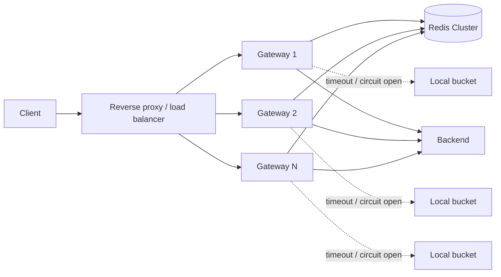

# Architecture

## Request path



This repository currently implements one gateway process and a three-master Redis Cluster on one Linux host. Running more gateway processes with different listen ports exercises the same shared Redis state.

## Central token bucket

For each API key, the gateway hashes the secret with SHA-256 and uses a Redis key of the form `rl:{digest}`. The API key itself is not stored in Redis.

The Lua script performs one atomic operation on one Redis Cluster key:

1. Read Redis server time (`TIME`) to avoid gateway clock skew.
2. Load `tokens` and the previous refill timestamp.
3. Refill `min(capacity, tokens + elapsed * refill_rate)`.
4. Allow and decrement when at least one token exists; otherwise calculate retry time.
5. Persist state and set an expiry so inactive client buckets disappear.
6. Return `{allowed, remaining, retry_ms}`.

Because the script executes atomically at the shard, two gateway nodes cannot both consume the same final token.

## Redis Cluster routing

The Java client uses Redis Cluster topology/slot routing. It does **not** implement a separate client-side consistent-hashing ring. Redis Cluster maps keys into its standard hash-slot space and moves slots as the cluster topology changes.

The `{digest}` hash tag makes the slot input explicit and leaves room for future multi-key operations for the same client without cross-slot errors.

## Degraded mode

A Redis timeout or error falls back to an in-process token bucket. The fallback policy divides both burst capacity and refill rate across the configured expected gateway count:

```text
local_capacity ~= ceil(global_capacity / gateway_count)
local_refill     = global_refill / gateway_count
```

This is intentionally availability-biased and approximate. Requests distributed unevenly among gateways can see under-utilization, and dynamic gateway counts require configuration updates. A simple circuit breaker stops hammering Redis after repeated failures and periodically retries after the open interval.

## Current scope vs target architecture

Implemented now: Java 26 gateway process; asynchronous Redis Cluster calls; atomic token bucket Lua script; Redis-side clock; SHA-256 API-key storage key; local degraded bucket; timeout + circuit breaker; 429/Retry-After/rate-limit headers; three-shard one-host Linux Redis Cluster; unit and end-to-end smoke tests.

Not yet implemented: reverse proxy configuration; generic backend proxying; metrics; dynamic policy store; cached Lua `EVALSHA`/Redis Functions optimization; hot-key mitigation; multi-region policy; production Redis replication/failover; 100k-QPS benchmark and capacity model.

## Hot key

Sharding distributes different API keys, but a single dominant API key still maps to one Redis primary. Potential next-stage strategies include hierarchical leasing (shard grants bounded local token batches to gateways), splitting one logical customer's budget across independently enforceable subkeys, or a dedicated policy for extremely hot customers. Those techniques trade exactness for load distribution and should be measured rather than added prematurely.
